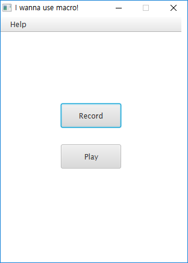
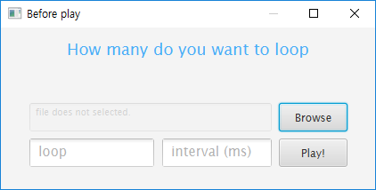

# macro

This is macro program which has record and play.

# Usage

First, you click the record button, file dailog will open and save your script file(result). And then, the record has been start. You can stop the record by clicking F8 button. 

After recording, click the play button. And this dialog will open. Open your script file and enter the number for loop, and interval.

After you click play button, the player will start and you can stop player by clicking F8 button.